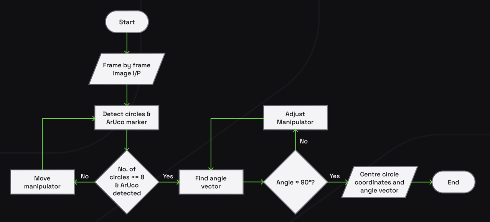
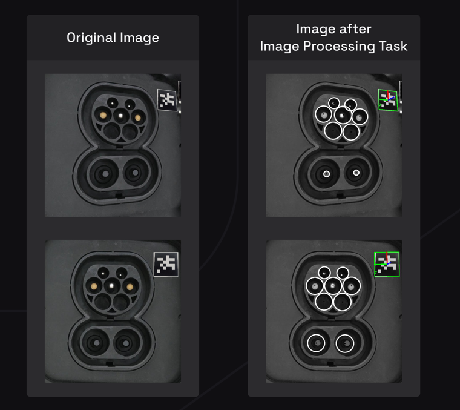
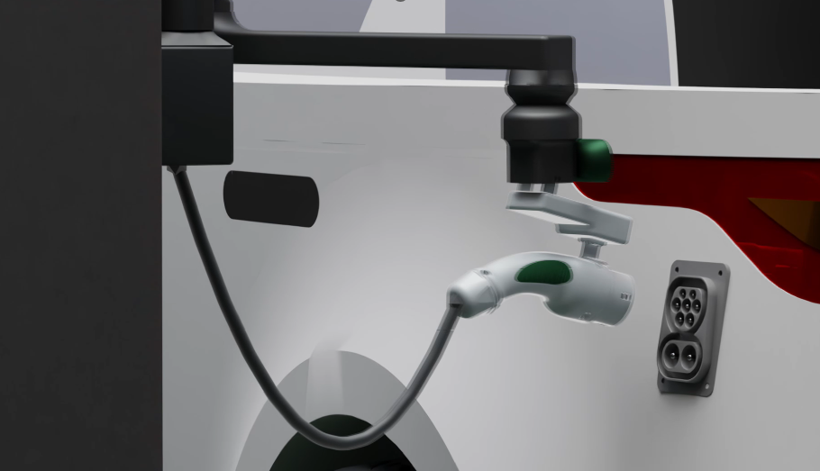

# Autonomous-Vehicle-Charging-System
-Problem statement by Jaguar Land Rover in Inter-IIT Tech Meet 11.0. 

- With the rise of EVs. Devising a system that can automatically detect the vehicle's charging port and plug the socket into the charging port is one step to advancing EV infrastructure.

- The goal is to build an Autonomous Robotic Charging System for Autonomous Vehicles by using Image Processing and IOT.

- The entire robotic manupilator system is desgined using CAD and simulations are carried out in MATLAB

- For the task of autonomously detecting the port, we have devised a solution in which the decision-tree algorithm serves as the foundation of the software architecture. 

- Through BLE Beacon of the car and the Bluetooth sensors, the approximate location of the socket is conveyed to the charging port. The camera then guides the manipulator further to the exact location via image processing by detecting an Aruco Marker placed near the charging port.

- Overview of Algorithm used

- Charging Socket Dectection

